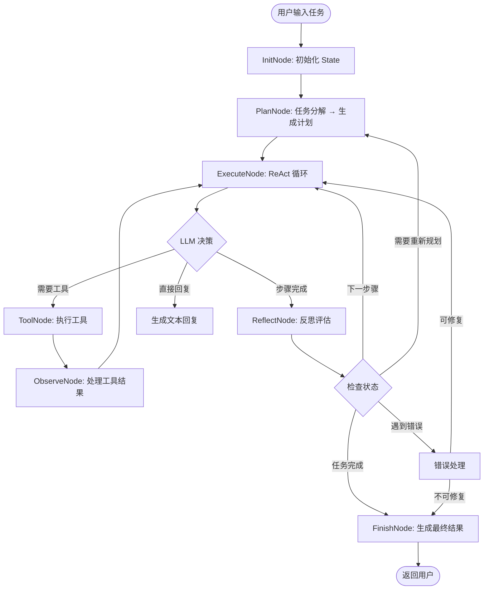
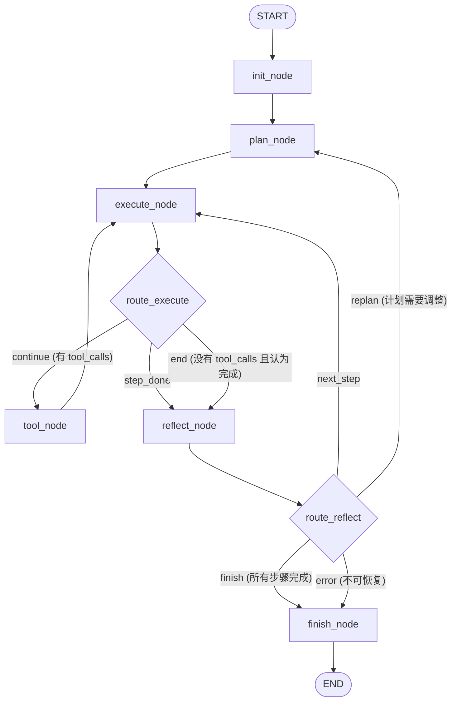

# Claude Code Mini — 系统架构设计文档

> **版本**: V1.0
> **作者**: AI Agent 架构设计
> **日期**: 2026-06-01
> **原则**: Working First, Architecture Second

---

## 目录

1. [Claude Code 能力拆解与版本规划](#1-claude-code-能力拆解与版本规划)
2. [总体架构设计](#2-总体架构设计)
3. [V1 目录结构](#3-v1-目录结构)
4. [Agent 执行流程](#4-agent-执行流程)
5. [LangGraph 设计](#5-langgraph-设计)
6. [Tool 体系设计](#6-tool-体系设计)
7. [Planner 设计](#7-planner-设计)
8. [Memory 设计](#8-memory-设计)
9. [开发路线 V1-V5](#9-开发路线-v1-v5)
10. [代码实现规划 Phase 1-4](#10-代码实现规划-phase-1-4)

---

## 1. Claude Code 能力拆解与版本规划

### 1.1 能力矩阵

| 能力 | 核心原理 | V1 | V2 | V3+ | 理由 |
|------|---------|:--:|:--:|:---:|------|
| **Context Engineering** | 系统提示词 + 项目上下文 + 对话历史 | ✅ | ✅ | ✅ | V1 硬编码系统提示词即可，V2 加入 CLAUDE.md 机制 |
| **Agent Loop** | think → act → observe → repeat | ✅ | ✅ | ✅ | 这是 Agent 的心跳，V1 必须有 |
| **Planning** | 任务分解为可执行步骤 | ✅ 轻量 | ✅ 增强 | ✅ | V1 用 LLM 直接出计划，V2 加入结构化规划 |
| **Tool Calling** | LLM 选择工具 + 执行 + 返回结果 | ✅ | ✅ | ✅ | V1 实现 4 个核心工具即可工作 |
| **Code Understanding** | 阅读文件 + 理解语义 | ✅ 基础 | ✅ | ✅ | V1 靠 LLM 读代码，不建索引 |
| **File Editing** | 精确字符串替换 | ✅ | ✅ | ✅ | Edit 工具是灵魂，V1 必须有 |
| **Shell Execution** | 运行命令 + 获取输出 | ✅ | ✅ | ✅ | 启动/测试/安装都依赖它 |
| **Self Reflection** | 评估执行结果 + 调整策略 | ✅ 基础 | ✅ | ✅ | V1 用简单的 "成功/失败" 判断 |
| **Self Correction** | 根据错误信息修复 | ✅ 基础 | ✅ | ✅ | V1 让 LLM 看到错误后重试 |
| **RAG / 代码索引** | 向量搜索 + 语义检索 | ❌ | ❌ | ✅ V3 | V1 用 grep 够用 |
| **MCP 协议** | 外部工具服务器 | ❌ | ❌ | ✅ V4 | 预留接口 |
| **多 Agent 协作** | 子 Agent 分发任务 | ❌ | ❌ | ✅ V4 | V1 单 Agent 即可 |
| **沙箱执行** | Docker 隔离 | ❌ | ✅ V2 | ✅ | V1 本地直接执行 |
| **长期记忆** | 向量数据库 + 摘要 | ❌ | ❌ | ✅ V3 | V1 会话内记忆足够 |
| **权限系统** | 分级确认 | ❌ | ❌ | ✅ V4 | V1 开发工具无需复杂权限 |

### 1.2 结论

**V1 核心公式**:

```
LLM + (ReadFile + WriteFile + EditFile + GrepSearch + GlobSearch + BashShell) = Claude Code Mini V1
```

**V1 最关键的两个能力**: Edit 工具（精确替换）和 Agent Loop（持续决策）。

---

## 2. 总体架构设计

### 2.1 架构图

```text
┌──────────────────────────────────────────────────────────┐
│                        User                               │
│                   (自然语言任务输入)                        │
└─────────────────────┬────────────────────────────────────┘
                      │
                      ▼
┌──────────────────────────────────────────────────────────┐
│                    CLI Layer (Rich)                       │
│              main.py — 入口 + 交互循环                      │
└─────────────────────┬────────────────────────────────────┘
                      │
                      ▼
┌──────────────────────────────────────────────────────────┐
│                   Agent Core                              │
│  ┌─────────┐  ┌──────────┐  ┌──────────┐  ┌──────────┐  │
│  │ Planner │  │ Executor │  │ Reflector│  │  Memory  │  │
│  │ 任务规划 │  │ 工具调度  │  │ 自我反思  │  │ 上下文记忆│  │
│  └────┬─────┘  └────┬─────┘  └────┬─────┘  └────┬─────┘  │
│       └──────────────┴─────────────┴──────────────┘       │
│                          │                                │
│              ┌───────────┴───────────┐                    │
│              │   LangGraph StateGraph │                    │
│              │   编排所有 Node 的执行   │                    │
│              └───────────────────────┘                    │
└─────────────────────┬────────────────────────────────────┘
                      │
                      ▼
┌──────────────────────────────────────────────────────────┐
│                  Tool System                              │
│  ┌──────────┐ ┌──────────┐ ┌──────────┐ ┌──────────┐    │
│  │ ReadFile │ │WriteFile │ │ EditFile │ │ BashShell│    │
│  └──────────┘ └──────────┘ └──────────┘ └──────────┘    │
│  ┌──────────┐ ┌──────────┐                               │
│  │GrepSearch│ │GlobSearch│                               │
│  └──────────┘ └──────────┘                               │
│              ToolRegistry · 统一注册与调度                  │
└─────────────────────┬────────────────────────────────────┘
                      │
                      ▼
┌──────────────────────────────────────────────────────────┐
│                 LLM Provider                              │
│         OpenAI / Anthropic / 兼容 API                      │
│         (通过 LangChain ChatModel 抽象)                    │
└──────────────────────────────────────────────────────────┘
```

### 2.2 各组件职责

#### Agent（智能体核心）

**职责**: 接收用户任务，协调 Planner → Executor → Reflector 的循环。

- 不是"一个类"，而是 LangGraph 编排的一套流程
- 持有 State，在 Node 之间传递
- 决定何时进入/退出循环

**对应文件**: `agent/agent.py`

#### Planner（规划器）

**职责**: 将模糊的用户需求转化为结构化的可执行计划。

- V1: 单次 LLM 调用，输出步骤列表
- 输入: 用户任务 + 项目上下文
- 输出: `List[TaskStep]`, 每个 Step 包含 `description` + `expected_tool` + `expected_output`

**对应文件**: `graph/nodes.py` → `plan_node()`

#### Executor（执行器）

**职责**: 根据当前计划步骤，选择合适的工具并执行。

- 本质是 ReAct 循环的 "Act" 部分
- V1 用 LangChain 的 tool-calling 机制：LLM 决定调用哪个工具、传什么参数
- 不自己做决策，只负责"执行 LLM 决定的操作"

**对应文件**: `graph/nodes.py` → `execute_node()`

#### Tool Manager（工具管理器）

**职责**: 注册工具、提供工具描述给 LLM、执行工具调用、格式化返回结果。

- 统一接口：每个工具都有 `name`, `description`, `parameters`(JSON Schema), `execute()`
- ToolRegistry 负责注册和查找
- 工具返回结果统一封装为 `ToolResult`

**对应文件**: `tools/registry.py`, `tools/base.py`

#### Runtime（运行时环境）

**职责**: 管理工作目录、Shell 执行环境、文件系统操作边界。

- V1: 简单的工作目录管理
- 所有文件操作限制在项目根目录内
- Shell 命令在项目根目录执行

**对应文件**: `runtime/workspace.py`

#### Memory（记忆系统）

**职责**: 保存对话历史、执行上下文、当前计划状态。

- V1: 纯内存，基于 LangChain 的 `ConversationBufferMemory`
- 保存: 用户消息 + AI 消息 + 工具调用 + 工具结果
- 受 LLM 上下文窗口限制（V1 不做压缩）

**对应文件**: `agent/state.py`

---

## 3. V1 目录结构

```text
claude-code-mini/
│
├── agent/                       # 核心 Agent 逻辑
│   ├── __init__.py
│   ├── agent.py                 # Agent 主类，创建和运行 Graph
│   └── state.py                 # AgentState 定义 (TypedDict)
│
├── graph/                       # LangGraph 图定义
│   ├── __init__.py
│   ├── builder.py               # build_graph() — 构建 StateGraph
│   └── nodes.py                 # 所有 Node 实现函数
│
├── tools/                       # 工具系统
│   ├── __init__.py
│   ├── base.py                  # BaseTool 抽象类 + ToolResult
│   ├── registry.py              # ToolRegistry 注册中心
│   ├── file_read.py             # ReadFileTool
│   ├── file_write.py            # WriteFileTool
│   ├── file_edit.py             # EditFileTool (精确替换)
│   ├── search_grep.py           # GrepSearchTool
│   ├── search_glob.py           # GlobSearchTool
│   └── shell.py                 # ShellTool
│
├── prompts/                     # Prompt 模板
│   ├── __init__.py
│   ├── system.py                # 系统提示词
│   └── templates.py             # 各类提示词模板
│
├── runtime/                     # 运行时环境
│   ├── __init__.py
│   └── workspace.py             # 工作目录管理 + 路径安全校验
│
├── config/                      # 配置管理
│   ├── __init__.py
│   ├── settings.py              # 全局配置 (Pydantic Settings)
│   └── llm.py                   # LLM 工厂函数
│
├── cli/                         # 命令行界面
│   ├── __init__.py
│   └── app.py                   # Rich 交互界面
│
├── tests/                       # 测试
│   ├── __init__.py
│   ├── test_tools.py
│   ├── test_graph.py
│   └── test_integration.py
│
├── main.py                      # 入口: python main.py
├── requirements.txt             # 依赖清单
├── .env.example                 # 环境变量示例
└── README.md
```

### 3.1 各目录职责说明

| 目录 | 职责 | 耦合方向 |
|------|------|---------|
| `agent/` | Agent 主类 + State 定义 | 依赖 graph, tools, prompts |
| `graph/` | LangGraph 图构建 + Node 实现 | 依赖 tools, prompts, agent.state |
| `tools/` | 工具抽象 + 具体实现 | **不依赖其他模块**（最底层） |
| `prompts/` | 纯字符串模板 | **零依赖** |
| `runtime/` | 工作目录、路径安全 | 不依赖其他模块 |
| `config/` | 配置 + LLM 工厂 | 不依赖其他模块 |
| `cli/` | Rich UI | 依赖 agent |
| `tests/` | 测试 | 依赖所有模块 |

**依赖规则**: `tools ← graph ← agent ← cli`, 禁止反向依赖。

---

## 4. Agent 执行流程

### 4.1 完整流程图



### 4.2 设计思想体现

| 思想 | 体现位置 | 说明 |
|------|---------|------|
| **ReAct** | ExecuteNode ↔ ToolNode ↔ ObserveNode | 思考→行动→观察→思考 的循环 |
| **Plan-and-Execute** | PlanNode → ExecuteNode → ReflectNode | 先规划后执行，按步骤推进 |
| **Self Reflection** | ReflectNode + ERROR_HANDLE | 每步执行后评估，失败时调整策略 |

### 4.3 完整执行时序

```text
User: "修复项目启动报错"

Step 1 — PlanNode:
  分析: 用户想修复启动错误
  计划:
    1. 搜索项目文件，了解项目结构
    2. 阅读入口文件（main.py / app.py）
    3. 执行启动命令，捕获错误
    4. 根据错误定位问题代码
    5. 修改代码
    6. 再次启动验证

Step 2 — ExecuteNode (子步骤 1):
  LLM 决策: 调用 GlobSearch("**/*.py")
  → ToolNode 执行
  → ObserveNode 获取结果

Step 3 — ExecuteNode (子步骤 2):
  LLM 决策: 调用 ReadFile("main.py")
  → ToolNode 执行
  → ObserveNode 获取内容

Step 4 — ExecuteNode (子步骤 3):
  LLM 决策: 调用 BashShell("python main.py")
  → ToolNode 执行
  → ObserveNode 获取: "ModuleNotFoundError: No module named 'requests'"

Step 5 — ExecuteNode (子步骤 4):
  LLM 决策: 调用 ReadFile("requirements.txt")
  → 发现缺少 requests

Step 6 — ExecuteNode (子步骤 5):
  LLM 决策: 调用 EditFile("requirements.txt", old="flask==2.0", new="flask==2.0\nrequests==2.28")
  → ToolNode 执行成功

Step 7 — ExecuteNode (子步骤 6):
  LLM 决策: 调用 BashShell("pip install -r requirements.txt && python main.py")
  → ToolNode 执行
  → ObserveNode: "Server started on port 5000" ✓

Step 8 — ReflectNode:
  所有子步骤完成，启动成功
  → CHECK → FINISH

Step 9 — FinishNode:
  汇总: "已修复：在 requirements.txt 中添加了缺失的 requests 依赖，项目现在可以正常启动"
```

---

## 5. LangGraph 设计

### 5.1 State 定义

```python
# agent/state.py

from typing import TypedDict, List, Annotated, Literal, Optional
from langgraph.graph.message import add_messages
from langchain_core.messages import BaseMessage
from pydantic import BaseModel


class TaskStep(BaseModel):
    """计划中的一个步骤"""
    id: str                          # 步骤 ID: "1", "2", "3"
    description: str                 # 步骤描述
    status: Literal["pending", "in_progress", "done", "failed"] = "pending"


class ToolCall(BaseModel):
    """一次工具调用记录"""
    tool_name: str
    params: dict
    result: str
    success: bool
    timestamp: str = ""              # ISO format


class AgentState(TypedDict):
    """Agent 全局状态 — 在 LangGraph 各 Node 间流转"""

    # === 任务 ===
    task: str                                    # 用户原始任务

    # === 对话历史 (LangGraph 自动管理 add_messages reducer) ===
    messages: Annotated[List[BaseMessage], add_messages]

    # === 计划 ===
    plan: List[dict]                             # List[TaskStep] 的序列化形式
    current_step_index: int                      # 当前执行到第几步

    # === 执行记录 ===
    tool_history: List[dict]                     # List[ToolCall] 序列化

    # === 状态控制 ===
    phase: str                                   # "init" | "planning" | "executing" | "reflecting" | "done" | "error"
    iteration: int                               # 当前迭代次数 (防止死循环)
    max_iterations: int                          # 最大迭代次数 (默认 30)

    # === 输出 ===
    error_message: str                           # 最近的错误信息
    final_answer: str                            # 最终返回给用户的内容
```

### 5.2 Node 设计

| Node | 函数名 | 输入 | 输出 (State 更新) | 说明 |
|------|--------|------|-------------------|------|
| **InitNode** | `init_node` | task | phase="planning" | 解析用户输入，初始化 State |
| **PlanNode** | `plan_node` | task, messages | plan, phase="executing" | LLM 分析任务，生成计划 |
| **ExecuteNode** | `execute_node` | plan, messages, current_step_index | messages (含 AI 回复) | LLM 决定下一步行动 (ReAct) |
| **ToolNode** | `tool_node` | messages (含 tool_calls) | messages (含 tool 结果), tool_history | LangGraph 内置 ToolNode |
| **ReflectNode** | `reflect_node` | messages, plan, current_step_index, tool_history | phase, current_step_index, error_message | 评估当前步骤是否完成 |
| **FinishNode** | `finish_node` | messages, plan, tool_history | phase="done", final_answer | 汇总执行结果 |

### 5.3 LangGraph StateGraph



### 5.4 条件路由函数

```python
# graph/builder.py 中的三个关键路由

def route_execute(state: AgentState) -> str:
    """ExecuteNode 之后的路由决策"""
    last_message = state["messages"][-1]

    # 如果 LLM 决定调用工具
    if hasattr(last_message, "tool_calls") and last_message.tool_calls:
        return "continue"  # → tool_node

    # 如果超时/超过最大迭代
    if state["iteration"] >= state["max_iterations"]:
        return "end"

    # 否则进入反思
    return "step_done"  # → reflect_node


def route_reflect(state: AgentState) -> str:
    """ReflectNode 之后的路由决策"""
    status = state["phase"]

    if status == "done":
        return "finish"
    if status == "error":
        return "error"
    if status == "executing":
        # 还有步骤未完成
        if state["current_step_index"] < len(state["plan"]):
            return "next_step"
        else:
            return "finish"
    if status == "planning":
        return "replan"

    return "finish"
```

### 5.5 图构建代码骨架

```python
# graph/builder.py

from langgraph.graph import StateGraph, END
from langgraph.prebuilt import ToolNode
from agent.state import AgentState
from graph.nodes import init_node, plan_node, execute_node, reflect_node, finish_node


def build_graph(llm, tools: list) -> StateGraph:
    """构建 Agent 的 LangGraph StateGraph"""

    workflow = StateGraph(AgentState)

    # 绑定工具到 LLM
    llm_with_tools = llm.bind_tools(tools)

    # 添加节点
    workflow.add_node("init", init_node)
    workflow.add_node("plan", plan_node)
    workflow.add_node("execute", execute_node(llm_with_tools))
    workflow.add_node("tools", ToolNode(tools))
    workflow.add_node("reflect", reflect_node)
    workflow.add_node("finish", finish_node)

    # 添加边
    workflow.set_entry_point("init")
    workflow.add_edge("init", "plan")
    workflow.add_edge("plan", "execute")

    # 条件路由
    workflow.add_conditional_edges(
        "execute",
        route_execute,
        {
            "continue": "tools",
            "step_done": "reflect",
            "end": "finish",
        }
    )
    workflow.add_edge("tools", "execute")  # 工具结果返回给 execute

    workflow.add_conditional_edges(
        "reflect",
        route_reflect,
        {
            "next_step": "execute",
            "replan": "plan",
            "finish": "finish",
            "error": "finish",
        }
    )

    workflow.add_edge("finish", END)

    return workflow.compile()
```

---

## 6. Tool 体系设计

### 6.1 UML 类图

```text
┌──────────────────────────────────────────┐
│           <<abstract>>                    │
│           BaseTool                        │
├──────────────────────────────────────────┤
│ + name: str                              │
│ + description: str                       │
│ + parameters: dict  (JSON Schema)        │
├──────────────────────────────────────────┤
│ + execute(**kwargs) → ToolResult         │
│ + to_langchain_tool() → StaticTool       │
└──────────────────┬───────────────────────┘
                   │
       ┌───────────┼───────────┬───────────────┐
       │           │           │               │
       ▼           ▼           ▼               ▼
┌──────────┐ ┌──────────┐ ┌──────────┐ ┌──────────────┐
│ReadFile  │ │WriteFile │ │EditFile  │ │  BashShell   │
│Tool      │ │Tool      │ │Tool      │ │  Tool         │
├──────────┤ ├──────────┤ ├──────────┤ ├──────────────┤
│+ read()  │ │+ write() │ │+ edit()  │ │+ execute()   │
└──────────┘ └──────────┘ └──────────┘ └──────────────┘

       ┌───────────┬────────────┐
       ▼           ▼            ▼
┌──────────┐ ┌──────────┐
│GrepSearch│ │GlobSearch│
│Tool      │ │Tool      │
├──────────┤ ├──────────┤
│+ search()│ │+ match() │
└──────────┘ └──────────┘


┌──────────────────────────────────────────┐
│           ToolRegistry                    │
├──────────────────────────────────────────┤
│ - _tools: dict[str, BaseTool]            │
├──────────────────────────────────────────┤
│ + register(tool: BaseTool) → None        │
│ + get(name: str) → BaseTool              │
│ + get_all() → List[BaseTool]             │
│ + get_langchain_tools() → List[StaticTool]│
└──────────────────────────────────────────┘


┌──────────────────────────────────────────┐
│           ToolResult (Pydantic)           │
├──────────────────────────────────────────┤
│ + success: bool                          │
│ + output: str                            │
│ + error: Optional[str]                   │
│ + metadata: dict                         │
└──────────────────────────────────────────┘
```

### 6.2 核心接口定义

```python
# tools/base.py

from abc import ABC, abstractmethod
from typing import Any, Optional
from pydantic import BaseModel


class ToolResult(BaseModel):
    """所有工具的统一返回格式"""
    success: bool
    output: str                    # 成功时的人类可读输出
    error: Optional[str] = None    # 失败时的错误信息
    metadata: dict = {}            # 额外元数据 (行数、文件大小等)


class BaseTool(ABC):
    """工具抽象基类 — 所有工具必须实现"""

    name: str                      # 工具唯一标识: "read_file"
    description: str               # 给 LLM 看的描述
    parameters: dict               # JSON Schema 参数定义

    @abstractmethod
    async def execute(self, **kwargs) -> ToolResult:
        """执行工具，返回统一格式结果"""
        ...

    def to_dict(self) -> dict:
        """序列化为 LangChain 兼容的工具描述"""
        return {
            "type": "function",
            "function": {
                "name": self.name,
                "description": self.description,
                "parameters": self.parameters,
            }
        }
```

### 6.3 V1 六个工具

#### ReadFileTool

```python
class ReadFileTool(BaseTool):
    name = "read_file"
    description = "读取文件内容。可以指定起始行和读取行数。"
    parameters = {
        "type": "object",
        "properties": {
            "file_path": {"type": "string", "description": "文件的绝对路径"},
            "offset": {"type": "integer", "description": "从第几行开始读，默认 1"},
            "limit": {"type": "integer", "description": "读取多少行，不指定则读全部"},
        },
        "required": ["file_path"]
    }
```

#### WriteFileTool

```python
class WriteFileTool(BaseTool):
    name = "write_file"
    description = "创建新文件或覆盖已存在的文件。用于创建新文件。"
    parameters = {
        "type": "object",
        "properties": {
            "file_path": {"type": "string", "description": "文件路径"},
            "content": {"type": "string", "description": "文件内容"},
        },
        "required": ["file_path", "content"]
    }
```

#### EditFileTool — 最关键的工具

```python
class EditFileTool(BaseTool):
    name = "edit_file"
    description = """精确字符串替换修改文件。
    提供 old_string 必须与文件中的内容完全匹配（包括空白字符）。
    用 new_string 替换 old_string。
    这是修改已有文件的唯一方式，不要用 write_file 修改已有文件。"""
    parameters = {
        "type": "object",
        "properties": {
            "file_path": {"type": "string", "description": "文件路径"},
            "old_string": {"type": "string", "description": "要替换的原始文本，必须精确匹配"},
            "new_string": {"type": "string", "description": "替换后的新文本"},
            "replace_all": {"type": "boolean", "description": "是否替换所有匹配，默认 False"},
        },
        "required": ["file_path", "old_string", "new_string"]
    }
```

#### GrepSearchTool

```python
class GrepSearchTool(BaseTool):
    name = "grep_search"
    description = "在文件中搜索正则表达式匹配的内容。返回匹配的文件路径和行内容。"
    parameters = {
        "type": "object",
        "properties": {
            "pattern": {"type": "string", "description": "正则表达式搜索模式"},
            "path": {"type": "string", "description": "搜索目录，默认当前工作目录"},
            "glob": {"type": "string", "description": "文件名过滤，如 '*.py'"},
        },
        "required": ["pattern"]
    }
```

#### GlobSearchTool

```python
class GlobSearchTool(BaseTool):
    name = "glob_search"
    description = "按文件名模式查找文件。支持 ** 递归匹配。"
    parameters = {
        "type": "object",
        "properties": {
            "pattern": {"type": "string", "description": "文件匹配模式，如 '**/*.py'"},
            "path": {"type": "string", "description": "搜索起始目录"},
        },
        "required": ["pattern"]
    }
```

#### ShellTool

```python
class ShellTool(BaseTool):
    name = "shell_execute"
    description = """执行 Shell 命令并返回输出。
    命令在当前项目根目录执行。
    长时间运行的命令（如启动服务器）会超时。"""
    parameters = {
        "type": "object",
        "properties": {
            "command": {"type": "string", "description": "要执行的 Shell 命令"},
            "timeout": {"type": "integer", "description": "超时秒数，默认 30"},
        },
        "required": ["command"]
    }
```

### 6.4 ToolRegistry 注册机制

```python
# tools/registry.py

class ToolRegistry:
    """工具注册中心 — 单例，管理所有工具"""

    _instance = None

    def __new__(cls):
        if cls._instance is None:
            cls._instance = super().__new__(cls)
            cls._instance._tools = {}
        return cls._instance

    def register(self, tool: BaseTool) -> None:
        """注册一个工具"""
        if tool.name in self._tools:
            raise ValueError(f"Tool '{tool.name}' already registered")
        self._tools[tool.name] = tool

    def get(self, name: str) -> BaseTool:
        """获取工具"""
        if name not in self._tools:
            raise KeyError(f"Tool '{name}' not found")
        return self._tools[name]

    def get_all(self) -> List[BaseTool]:
        """获取所有工具"""
        return list(self._tools.values())

    def get_tool_schemas(self) -> List[dict]:
        """获取所有工具的 JSON Schema（给 LLM 做 function calling）"""
        return [tool.to_dict() for tool in self._tools.values()]

    @classmethod
    def create_default(cls, workspace_path: str) -> "ToolRegistry":
        """工厂方法 — 创建包含 V1 6 个工具的默认注册中心"""
        registry = cls()
        registry.register(ReadFileTool(workspace_path))
        registry.register(WriteFileTool(workspace_path))
        registry.register(EditFileTool(workspace_path))
        registry.register(GrepSearchTool(workspace_path))
        registry.register(GlobSearchTool(workspace_path))
        registry.register(ShellTool(workspace_path))
        return registry
```

### 6.5 工具调用流程

```text
LLM 决定的 tool_calls:
  [{"name": "read_file", "arguments": {"file_path": "/app/main.py"}}]
        │
        ▼
ToolRegistry.get("read_file")
        │
        ▼
ReadFileTool.execute(file_path="/app/main.py")
        │
        ▼
ToolResult(success=True, output="import flask\napp = ...", error=None)
        │
        ▼
格式化为 LangChain ToolMessage:
  ToolMessage(
    content="[read_file 成功]\nimport flask\napp = ...",
    tool_call_id="call_xxx"
  )
        │
        ▼
追加到 messages，LLM 在下一轮能看到
```

---

## 7. Planner 设计

### 7.1 规划流程

```text
User Task: "给这个项目添加日志功能"

        ▼
┌──────────────────────────────────────┐
│         PlanNode (LLM 调用)           │
│                                      │
│  System Prompt:                      │
│  "你是一个任务规划专家。请将用户任务  │
│   分解为 3-7 个可执行的步骤。"        │
│                                      │
│  输出格式:                            │
│  [                                   │
│    {"id":"1","desc":"搜索项目文件"},   │
│    {"id":"2","desc":"阅读主入口文件"},  │
│    {"id":"3","desc":"添加logging配置"},│
│    {"id":"4","desc":"在关键位置加日志"},│
│    {"id":"5","desc":"运行测试验证"}    │
│  ]                                   │
└──────────────────┬───────────────────┘
                   │
                   ▼
        ┌─────────────────┐
        │  Task List       │
        │  (List[TaskStep])│
        └────────┬────────┘
                 │
                 ▼
        ┌─────────────────┐
        │  逐步骤执行       │
        │  ExecuteNode     │
        │  每个步骤内 ReAct │
        └─────────────────┘
```

### 7.2 TaskStep 对象

```python
class TaskStep(BaseModel):
    id: str                                    # "1", "2", "3"
    description: str                           # "搜索项目中所有 Python 文件"
    hints: Optional[str] = None                # LLM 给执行者的提示
    expected_tools: Optional[List[str]] = None # 可能用到的工具: ["glob_search", "read_file"]
    status: Literal["pending", "in_progress", "done", "failed"] = "pending"
    retry_count: int = 0                       # 已重试次数
    max_retries: int = 2                       # 最大重试次数
```

### 7.3 状态管理

```text
pending ──→ in_progress ──→ done
                │
                ├──→ failed ──→ pending (retry_count < max_retries)
                │
                └──→ failed (retry_count >= max_retries) → 整体任务标记为 partial_success
```

### 7.4 失败重试机制

```python
# graph/nodes.py — reflect_node 中的逻辑

def reflect_node(state: AgentState) -> dict:
    current_step = state["plan"][state["current_step_index"]]

    # 检查最近一次工具调用是否成功
    last_tool_result = state["tool_history"][-1] if state["tool_history"] else None

    if last_tool_result and not last_tool_result["success"]:
        # 工具执行失败
        current_step["retry_count"] += 1

        if current_step["retry_count"] < current_step["max_retries"]:
            # 可以重试：保留当前步骤，把错误信息加入上下文
            return {
                "phase": "executing",
                "error_message": last_tool_result["error"],
                # current_step_index 不变，下次循环重试
            }
        else:
            # 超过最大重试次数：标记失败，继续下一步
            current_step["status"] = "failed"
            return {
                "phase": "executing",
                "current_step_index": state["current_step_index"] + 1,
            }

    # 成功：标记完成，推进到下一步
    current_step["status"] = "done"
    next_index = state["current_step_index"] + 1

    if next_index >= len(state["plan"]):
        return {"phase": "done"}
    else:
        return {"phase": "executing", "current_step_index": next_index}
```

---

## 8. Memory 设计

### 8.1 V1 Memory 架构

```text
┌─────────────────────────────────────────────────┐
│               AgentState (V1 Memory)             │
│                                                  │
│  ┌──────────────────────────────────────────┐   │
│  │  Conversation Memory (messages)           │   │
│  │  LangGraph 自动管理的消息列表               │   │
│  │  包含: 用户消息 → AI消息 → 工具调用 →       │   │
│  │        工具结果 → AI消息 → ...              │   │
│  │  生命周期: 单次会话                         │   │
│  └──────────────────────────────────────────┘   │
│                                                  │
│  ┌──────────────────────────────────────────┐   │
│  │  Task Memory (plan + current_step_index)  │   │
│  │  当前任务计划 + 执行进度                    │   │
│  │  生命周期: 单次任务执行期间                  │   │
│  └──────────────────────────────────────────┘   │
│                                                  │
│  ┌──────────────────────────────────────────┐   │
│  │  Execution History (tool_history)         │   │
│  │  所有工具调用的记录: 工具名 + 参数 + 结果   │   │
│  │  生命周期: 单次任务执行期间                  │   │
│  └──────────────────────────────────────────┘   │
└─────────────────────────────────────────────────┘
```

### 8.2 保存内容

| 类别 | 内容 | 用途 | 存储方式 |
|------|------|------|---------|
| 对话历史 | 用户消息 + AI 消息 + 工具调用 + 工具结果 | LLM 上下文，保持对话连续性 | LangGraph State (messages) |
| 任务计划 | 步骤列表 + 每步状态 | 跟踪进度，判断下一步做什么 | State (plan, current_step_index) |
| 工具历史 | 工具名 + 输入参数 + 输出 + 成功/失败 | 避免重复操作，错误排查 | State (tool_history) |
| 错误信息 | 最近的错误消息 | 帮助 LLM 理解失败原因并进行修复 | State (error_message) |

### 8.3 如何参与推理

1. **messages** — 直接作为 LLM 的输入上下文，LLM 能看到完整的对话历史
2. **plan** — 在执行每一步前，将"当前计划 + 进度"注入到 system prompt 中
3. **tool_history** — 进入 ReflectNode 时，分析最近 N 次工具调用是否有效
4. **error_message** — 执行失败后，将错误信息显式注入下一轮 LLM 调用的上下文

### 8.4 未来扩展到 RAG + 长期记忆

```text
V3 扩展后的 Memory 架构:

┌─────────────────────────────────────────────────┐
│              Memory System V3                    │
│                                                  │
│  ┌──────────────┐  ┌──────────────┐             │
│  │ Short-Term    │  │ Long-Term    │             │
│  │ (V1 已有)     │  │ (V3 新增)    │             │
│  │ 对话上下文     │  │ 向量数据库    │             │
│  └──────┬───────┘  └──────┬───────┘             │
│         │                 │                      │
│         ▼                 ▼                      │
│  ┌──────────────────────────────────────────┐   │
│  │         Memory Manager                    │   │
│  │  统一管理短期 + 长期记忆检索                │   │
│  └──────────────────┬───────────────────────┘   │
│                     │                           │
│                     ▼                           │
│  ┌──────────────────────────────────────────┐   │
│  │         Context Builder                   │   │
│  │  组合: 系统提示词 + 检索结果 + 对话历史      │   │
│  └──────────────────────────────────────────┘   │
└─────────────────────────────────────────────────┘

扩展接口预留:
  class LongTermMemory(ABC):
      async def add(self, content: str, metadata: dict) -> None: ...
      async def search(self, query: str, k: int = 5) -> List[Document]: ...
      async def summarize_session(self, messages: list) -> str: ...

  class ProjectMemory(LongTermMemory):
      """项目级别的长期记忆 — 记住项目结构、关键文件、之前的修改"""
      ...
```

---

## 9. 开发路线 V1-V5

```text
V1 ────────→ V2 ────────→ V3 ────────→ V4 ────────→ V5
单Agent      增强规划     项目记忆      多Agent      完整架构
Weekend      2周          1个月         2个月        持续演进
```

### V1 — Claude Code Mini MVP (Weekend)

**目标**: 能完成真实编码任务的单 Agent

**新增能力**:

- ✅ 6 个核心工具 (Read/Write/Edit/Grep/Glob/Shell)
- ✅ LangGraph ReAct + Plan-Execute 混合循环
- ✅ 轻量级规划 (LLM 单次调用出计划)
- ✅ 基础自我反思 (成功/失败判断 + 重试)
- ✅ Rich CLI 界面
- ✅ 会话内记忆 (对话历史 + 工具历史)
- ✅ 支持 OpenAI / Anthropic API
- ❌ 不含: RAG, MCP, 多Agent, 沙箱, 长期记忆

**验证标准**: Agent 能独立完成 "找出 bug → 读代码 → 定位问题 → 修改 → 验证" 的完整流程。

### V2 — 增强规划与沙箱

**新增能力**:

- ✅ 结构化规划器 (Plan Validator + Plan Optimizer)
- ✅ Docker 沙箱执行 (Shell 命令在容器内运行)
- ✅ 更好的错误恢复 (多种错误模式识别)
- ✅ Session 持久化 (中断后可以继续)
- ✅ 配置文件支持 (CLAUDE.md 机制)
- ✅ 工具执行缓存 (相同命令不重复执行)

### V3 — RAG 与项目记忆

**新增能力**:

- ✅ 代码索引 (基于 Chroma/chroma 的轻量向量搜索)
- ✅ 项目长期记忆 (记住项目结构、API、文件关系)
- ✅ RAG 检索增强 (搜索相似代码片段)
- ✅ 上下文窗口管理 (自动摘要 + 压缩)
- ✅ 多文件编辑事务 (一次修改多个相关文件)

### V4 — 多 Agent 协作

**新增能力**:

- ✅ 子 Agent 分发 (Planner 生成子任务 → 分发给 Worker Agent)
- ✅ MCP 协议支持 (接入外部工具)
- ✅ 权限确认系统 (危险操作需要用户确认)
- ✅ 并行工具执行
- ✅ Agent 通信协议

### V5 — 生产级架构

**新增能力**:

- ✅ 完整的测试框架
- ✅ 性能优化 (缓存 LLM 响应)
- ✅ 插件系统
- ✅ IDE 集成 (VS Code 插件)
- ✅ 多模型路由 (不同任务用不同模型)
- ✅ 指标监控

---

## 10. 代码实现规划 Phase 1-4

### Phase 1: 地基 — Tool System + LLM (4 小时)

**实现模块**:

```
tools/base.py          # BaseTool + ToolResult
tools/registry.py       # ToolRegistry
tools/file_read.py      # ReadFileTool
tools/file_write.py     # WriteFileTool
tools/file_edit.py      # EditFileTool
tools/search_grep.py    # GrepSearchTool
tools/search_glob.py    # GlobSearchTool
tools/shell.py          # ShellTool
config/settings.py      # 配置
config/llm.py           # LLM 工厂
runtime/workspace.py    # 工作目录管理
tests/test_tools.py     # 工具单元测试
```

**为什么先实现这个**:
- 工具系统是 Agent 的"手脚"，没有工具 Agent 只是聊天机器人
- 工具可以独立测试，不需要依赖 LangGraph
- EditFileTool 是最复杂的工具，需要先验证其精确替换逻辑

**预期能力**: 能从 Python 代码中直接调用工具，每个工具功能正确

**如何验证**:

```bash
# 直接运行测试
python -m pytest tests/test_tools.py -v

# 手动验证
python -c "
from tools.registry import ToolRegistry
registry = ToolRegistry.create_default('.')
result = registry.get('read_file').execute(file_path='main.py')
print(result.output)
"
```

### Phase 2: 骨架 — LangGraph + Agent Loop (4 小时)

**实现模块**:

```
agent/state.py         # AgentState 定义
agent/agent.py         # Agent 主类
graph/builder.py       # StateGraph 构建
graph/nodes.py         # init, plan, execute, reflect, finish Node
prompts/system.py      # 系统提示词
prompts/templates.py   # 各类提示词模板
tests/test_graph.py    # Graph 单元测试
```

**为什么第二个实现**:
- 有了工具后，Agent Loop 是把工具串起来的骨架
- LangGraph 是编排层，依赖工具但不应早于工具
- 这个阶段让 Agent 真正"活起来"

**预期能力**: Agent 能完成单步骤任务，如 "读取 main.py 并告诉我它做了什么"

**如何验证**:

```bash
python -c "
from agent.agent import ClaudeCodeMini
agent = ClaudeCodeMini(workspace='.')
result = await agent.run('读取 README.md 并告诉我项目名称')
print(result)
"
```

### Phase 3: 大脑 — Planner + Reflector (3 小时)

**实现模块**:

```
graph/nodes.py    # 增强 plan_node (结构化输出)
graph/nodes.py    # 增强 reflect_node (错误分析 + 重试)
graph/builder.py  # 完善条件路由
prompts/system.py # 优化提示词
```

**为什么第三个实现**:
- Plan 和 Reflect 决定 Agent 的"智能"程度
- 需要 Phase 2 的 Agent Loop 能跑通，才能调试规划质量
- 提示词调优是最需要迭代的部分

**预期能力**: Agent 能完成多步骤任务，如 "在项目中添加一个日志模块并在 main.py 中使用它"

**如何验证**:

```python
# 多步骤集成测试
result = await agent.run("""
    1. 找到所有导入 flask 的文件
    2. 在每个文件中添加一行注释 # Flask import
    3. 确认修改正确
""")
assert result["phase"] == "done"
```

### Phase 4: 外壳 — CLI + 集成测试 (3 小时)

**实现模块**:

```
cli/app.py               # Rich 交互界面
main.py                  # 入口点
tests/test_integration.py # 端到端测试
README.md                # 使用文档
requirements.txt         # 冻结依赖
```

**为什么最后实现**:
- CLI 是"壳"，里面的 Agent 要先能工作
- 集成测试需要完整的功能链条
- README 要在功能稳定后写

**预期能力**:

```bash
$ python main.py

╔══════════════════════════════════════════╗
║        Claude Code Mini v1.0.0          ║
║     Working First, Architecture Second  ║
╚══════════════════════════════════════════╝

📁 workspace: /home/user/myproject
🤖 model: gpt-4o
🔧 tools: read_file, write_file, edit_file, grep_search, glob_search, shell_execute

> 帮我修复项目启动报错

[Planner] 分析任务中...
[Planner] 计划已生成:
  1. 搜索项目文件了解结构
  2. 阅读入口文件
  3. 执行启动命令获取错误
  4. 根据错误修改代码
  5. 验证修复

[Step 1/5] 搜索项目文件了解结构
  🔧 glob_search("**/*.py") → 找到 12 个文件

[Step 2/5] 阅读入口文件
  🔧 read_file("main.py") → 已读取 45 行

...

[Step 5/5] 验证修复
  🔧 shell_execute("python main.py") → Server started ✓

✅ 任务完成！
已在 requirements.txt 中添加缺失的 requests 依赖，项目启动正常。
```

### Phase 依赖关系

```text
Phase 1 (Tool System)
    │
    ▼
Phase 2 (Agent Loop + LangGraph)
    │
    ▼
Phase 3 (Planner + Reflector)
    │
    ▼
Phase 4 (CLI + Integration)
```

### 总预估工时

| Phase | 内容 | 预估时间 |
|-------|------|---------|
| Phase 1 | Tool System + LLM | 4 小时 |
| Phase 2 | LangGraph + Agent Loop | 4 小时 |
| Phase 3 | Planner + Reflector | 3 小时 |
| Phase 4 | CLI + 测试 | 3 小时 |
| **合计** | | **~14 小时 (一个周末)** |

---

## 附录 A: 关键设计决策记录

| 决策 | 选择 | 理由 |
|------|------|------|
| 框架 | LangChain + LangGraph | 用户熟悉，生态成熟，减少样板代码 |
| 工具基类 | 自定义 BaseTool | 比直接继承 LangChain BaseTool 更灵活，V2 可以无缝迁移 |
| State | TypedDict | 比 Pydantic Model 更兼容 LangGraph 的 StateGraph |
| 规划方式 | LLM 直接输出 JSON | V1 最简单可用的方式，V2 再做结构化 |
| Memory | 纯内存 | V1 不需要持久化，LangGraph State 自带 |
| 工具数量 | 6 个 | Read, Write, Edit, Grep, Glob, Shell — 刚好够用 |
| 多 Agent | V4 再做 | V1 单 Agent 足够完成大多数编码任务 |

## 附录 B: 依赖清单

```text
# requirements.txt
langchain>=0.3.0
langgraph>=0.2.0
langchain-openai>=0.2.0     # OpenAI 兼容 API
langchain-anthropic>=0.2.0  # Anthropic API (可选)
pydantic>=2.0
rich>=13.0
python-dotenv>=1.0

# 开发依赖
pytest>=8.0
pytest-asyncio>=0.24
```

**6 个核心依赖**，无数据库、无消息队列、无向量库。

---

> **文档结束**
>
> 下一步：进入 Phase 1 代码实现。
> 原则不变：**Working First, Architecture Second**。
