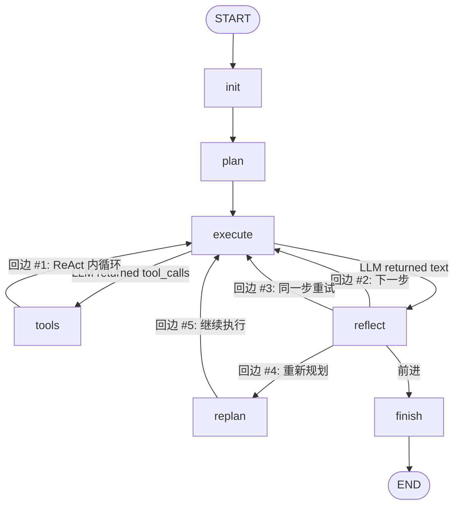

# Claude Code Mini — Agent Loop 审计报告

> **审计日期**: 2026-06-01
> **审计范围**: 全部 graph/nodes.py, graph/builder.py, agent/state.py
> **审计方法**: 静态代码分析 + 实际执行路径追踪

---

## 第一部分：执行流程审计

### 1.1 完整执行链路

```text
用户请求
   │
   ▼
[init_node]               ← 仅一次
   │
   ▼
[plan_node]               ← LLM 调用，产出 JSON plan[]，仅一次
   │
   ▼
[execute_node]            ← LLM 调用（带 tools），注入 step_context
   │                        THIS IS THE REACT ENTRY POINT
   ├──→ LLM Returns tool_calls?
   │         │ YES
   │         ▼
   │    [tool_node]        ← 执行工具，产出 ToolMessage
   │         │
   │         └──→ [execute_node]   ← 回边 #1: tools → execute
   │                   │
   │         LLM Returns text (no tool_calls)?
   │                   │
   ├──→ [reflect_node]    ← 回边 #2: execute → reflect
   │         │
   │         ├── phase="executing"  → [execute_node]   回边 #3: next step
   │         ├── phase="retry"     → [execute_node]   回边 #4: same step, error context
   │         ├── phase="replan"    → [replan_node] → [execute_node]  回边 #5
   │         └── phase="done"      → [finish_node] → END
   │
   ▼
[finish_node]             ← LLM 调用，生成最终摘要
   │
   ▼
  END
```

### 1.2 是否存在循环？✅ 存在

项目中存在 **5 条回边/循环边**：

| 回边 | 边定义 | 循环类型 |
|------|--------|---------|
| #1 | `workflow.add_edge("tools", "execute")` | **ReAct 内循环**: LLM 看到工具结果 → 决定下一步 → 调工具 → 再看到结果 |
| #2 | `execute → reflect → execute` (new step) | **步骤间循环**: 完成步骤 N → 推进到步骤 N+1 |
| #3 | `execute → reflect → execute` (retry) | **重试循环**: 步骤失败 → 注入错误信息 → 重新执行同一步 |
| #4 | `execute → reflect → replan → execute` | **重新规划循环**: 计划错误 → LLM 重写剩余步骤 → 继续执行 |
| #5 | `tools → execute → tools → execute → ...` | **无限 tool 调用循环**（单步内）：LLM 可在同一步内连续调用多次工具 |

**结论**: 循环存在。这不是一次性流程。

```python
# 关键代码 — builder.py:142,152,166
workflow.add_edge("tools", "execute")          # 回边 #1
workflow.add_edge("replan", "execute")         # 回边 #4
# 条件路由提供回边 #2, #3
```

### 1.3 是否存在 Observation 回流？✅ 存在（但有限制）

**回流机制**:

```
tool_node 产出 ToolMessage
    │
    ▼
LangGraph add_messages reducer 自动追加到 state.messages
    │
    ▼
execute_node 读取 state.messages 作为 LLM 上下文
    │
    ▼
LLM 看到 ToolMessage → 据此决定下一步
```

**证据** — `graph/nodes.py:256-263`:

```python
messages = state["messages"]      # ← 包含所有历史 ToolMessage
invoke_messages = list(messages) + [context_message]
response = await llm_with_tools.ainvoke(invoke_messages)  # ← LLM 看到工具结果
```

**限制**: 消息超过 40 条会被截断（只保留最近的消息），可能丢失早期上下文：

```python
MAX_MSG_COUNT = 40
if len(messages) > MAX_MSG_COUNT:
    system_msgs = [m for m in messages if isinstance(m, SystemMessage)]
    recent_msgs = messages[-(MAX_MSG_COUNT - len(system_msgs)):]
    invoke_messages = system_msgs + recent_msgs + [context_message]
```

### 1.4 是否存在动态决策？⚠️ 半动态

**决策点 1 — route_after_execute**（`builder.py:30-44`）:

```python
if last_message.tool_calls:
    return "tools"      # LLM 决定调用工具
return "reflect"         # LLM 决定步骤完成
```

✅ 这是真正的动态决策 — LLM 自主选择：继续调工具 vs 步骤完成。

**决策点 2 — route_after_reflect**（`builder.py:47-64`）:

```python
if phase == "executing": return "execute"   # 下一步
elif phase == "retry":   return "execute"   # 重试
elif phase == "replan":  return "replan"    # 重新规划
else:                    return "finish"    # 结束
```

✅ 基于 reflect_node 的判断结果路由。

**决策点 3 — reflect_node 内部**（`nodes.py:377-640`）:

复杂的决策逻辑：
1. 启发式预检（`all_step_tools_failed` → 自动 retry）
2. LLM 评价（`error_type`: recoverable/fatal/wrong_approach）
3. 安全覆写（LLM 说 success 但工具全失败 → 强制 retry）
4. 最终决定：retry / replan / advance / finish

✅ 这是真正的智能路由。

**结论**: 决策是动态的，**不是**固定执行预定义流程。但有一个关键限制（见下文 P0）。

---

## 第二部分：LangGraph 结构审计

### 2.1 完整 StateGraph



### 2.2 回边计数

| 来源 | 目标 | 类型 | 触发条件 |
|------|------|------|---------|
| tools → execute | execute | 固定边 | tool 执行完成后总是回到 execute |
| reflect → execute | execute | 条件边 | phase in ("executing", "retry") |
| replan → execute | execute | 固定边 | replan 完成后总是回到 execute |

### 2.3 终止条件

| 条件 | 位置 | 说明 |
|------|------|------|
| `iteration >= max_iterations` | `nodes.py:388` | reflect_node 全局上限守卫 |
| `step_retry_count > max_retries` | `nodes.py:405` | 单步重试上限 |
| `step_idx >= len(plan)` | `nodes.py:624` | 计划耗尽 |
| `not plan` | `nodes.py:398` | 空计划 |
| `phase == "done"` | `builder.py:63` | route_after_reflect → finish |

✅ 终止条件充分。**不会无限循环**。

---

## 第三部分：State 设计审计

### 3.1 当前 State 字段全览

| 字段 | 类型 | 用途 | 状态 |
|------|------|------|------|
| `task` | `str` | 用户原始任务 | ✅ |
| `messages` | `List[BaseMessage]` (add_messages) | 完整对话历史 | ✅ |
| `plan` | `List[dict]` | 任务步骤计划 | ✅ |
| `current_step_index` | `int` | 当前步骤索引 | ✅ |
| `tool_history` | `List[dict]` | 工具调用记录 | ✅ |
| `step_start_tool_count` | `int` | 步骤边界追踪 | ✅ |
| `phase` | `str` | 当前阶段 | ✅ |
| `iteration` | `int` | 循环计数 | ✅ |
| `max_iterations` | `int` | 循环上限 | ✅ |
| `step_retry_count` | `int` | 步骤重试计数 | ✅ |
| `max_retries_per_step` | `int` | 重试上限 | ✅ |
| `error_message` | `str` | 最近错误 | ✅ |
| `final_answer` | `str` | 最终输出 | ✅ |

### 3.2 缺失分析

| 缺失字段 | 导致问题 |
|----------|---------|
| ❌ 无 `observations` 独立字段 | 观察结果嵌入 messages，无法结构化查询 |
| ❌ 无 `completed_steps` 独立记录 | 已完成步骤信息散落在 plan 和 tool_history 中 |
| ❌ 无 `context_summary` | 长对话压缩后丢失的信息无法恢复 |

⚠️ 轻度问题。V1 不必修，但 V2 建议拆分。

---

## 第四部分：Tool 调用审计

### 4.1 ToolResult 结构

```python
class ToolResult(BaseModel):
    success: bool       # ✅ 成功/失败标记
    output: str         # ✅ 人类可读输出
    error: Optional[str]  # ✅ 错误信息
    metadata: dict      # ✅ 额外数据
```

### 4.2 工具结果参与决策的链路

```
tool_node 执行工具
   │
   ▼
ToolResult.to_langchain_message() → ToolMessage(content=output)
   │
   ▼
存储到 tool_history[] (含 success 字段)
   │
   ▼
ToolMessage 追加到 messages (add_messages)
   │
   ▼
下一轮 execute_node: LLM 看到 ToolMessage
   │
   ▼
reflect_node: 读取 tool_history 中 success 字段 → 启发式预检
```

**✅ 工具结果不仅被打印，还真正参与 Agent 的决策。** 具体体现：

1. `success: False` → 启发式预检触发自动 retry（`nodes.py:453-468`）
2. ToolMessage 内容 → LLM 看到失败详情 → 下一轮可能选择不同的工具
3. `_build_failure_suggestion()` → 根据失败工具类型生成针对性修复建议

---

## 第五部分：Reflection 能力审计

### 5.1 是否存在 Self Reflection？✅ 存在

**两层反思**:

1. **启发式层** (pre-LLM): 统计本步骤工具失败率 → 自动决策（`nodes.py:439-486`）
2. **LLM 层**: 分析 agent_response + tool 结果 → 输出 JSON 判断（`nodes.py:512-524`）

```python
reflection = {
    "step_done": True/False,     # 步骤是否完成
    "success": True/False,       # 是否成功
    "error_type": "none"|"recoverable"|"fatal"|"wrong_approach",
    "should_retry": True/False,
    "should_replan": True/False,
    "retry_suggestion": "..."    # 重试建议
}
```

### 5.2 是否存在 Self Correction？✅ 存在（两步）

**步骤级 Self Correction**:

```
shell_execute 失败 (exit code != 0)
   ↓
tool_history 记录 success=False
   ↓
reflect_node: 启发式预检检测到失败
   ↓
phase="retry" → execute_node: 注入 RETRY_CONTEXT_TEMPLATE
   ↓
LLM 看到: "Previous Attempt Failed" + "Tool failures in this step:" + 具体错误
   ↓
LLM 尝试不同的方法重新执行此步骤
```

**计划级 Self Correction**:

```
plan 假设项目使用 Flask，但搜索发现是 FastAPI
   ↓
reflect_node: LLM 判断 error_type="wrong_approach"
   ↓
phase="replan" → replan_node: 保留已完成步骤，LLM 重写剩余计划
   ↓
新计划基于实际项目结构 → 继续执行
```

### 5.3 Retry 机制

```
同一步骤内:
  尝试 #1 → 失败 → reflect → retry → 尝试 #2 → 失败 → reflect → retry → 尝试 #3
  ↓
  step_retry_count=3 > max_retries_per_step=2
  ↓
  标记 failed → 推进下一步
```

✅ Retry 限制明确：每步最多 3 次尝试（0, 1, 2 即 3 次），超过则跳过。

---

## 第六部分：Claude Code 对比分析

| 能力 | 当前项目 | Claude Code | 差距 |
|------|---------|-------------|------|
| **Tool Use** | 6 个工具，function calling | 同等，但工具更多 | ✅ 接近 |
| **Planning** | plan_node 一次生成完整计划，然后逐步执行 | 无显式 plan 节点 — LLM 隐式推理下一步 | ⚠️ 当前项目更结构化但更僵硬 |
| **Agent Loop** | Plan → Execute → Tool → Execute → Reflect → (advance/retry/replan) | 自由循环: Think → Act → Observe → ... → Finish | ⚠️ 当前项目被 plan 步骤限制 |
| **Reflection** | 启发式 + LLM 双层层 | LLM 自主反思，无独立 reflect 节点 | ⚠️ 当前项目更安全但增加延迟 |
| **Memory** | 会话内 messages + tool_history | 会话内 + 跨会话 CLAUDE.md | ⚠️ 无跨会话记忆 |
| **Self Correction** | 步骤级 retry + 计划级 replan | LLM 自主根据错误信息修复 | ✅ 接近 |
| **动态性** | plan 是静态的，LLM 不能"跳过"步骤或插入新步骤 | LLM 完全自主：随时改变策略 | ❌ 架构性差距 |
| **步骤粒度** | 一个 "step" 内可能有多次 tool 调用，但 step 边界由 LLM 出 text（不调 tool）定义 | 无 step 概念，LLM 自由决定何时完成 | ⚠️ 当前设计限制 ReAct 自由度 |
| **Context Engineering** | 系统 prompt + step_context + 截断 | 系统 prompt + CLAUDE.md + 项目文件 + 缓存 | ⚠️ 未实现 CLAUDE.md 机制 |
| **Error Recovery** | 3 层: LLM retry + step retry + plan replan | LLM 自主处理，无上限 | ✅ 当前项目更防御性 |

### 核心差距总结

当前项目的架构本质是 **Plan-and-Execute with ReAct sub-loops**：

```
Plan (一次性) → Execute Step 1 (内嵌 ReAct) → Execute Step 2 (内嵌 ReAct) → ...
```

而 Claude Code 的架构是 **纯 ReAct**：

```
Reason → Act → Observe → Reason → Act → Observe → ... (LLM 自己决定何时结束)
```

**关键差异**: 当前项目的 LLM 被绑定在 "步骤" 的牢笼里。它不能：
- 跳过计划中的步骤
- 插入新步骤（除非通过 replan_node 整段重写）
- 在"步骤完成"前主动宣告任务完成

---

## 第七部分：关键问题清单

### P0 — 必须修复

| # | 问题 | 位置 | 影响 |
|---|------|------|------|
| P0-1 | **假 ReAct 循环** — LLM 不能自由地在调工具和"完成任务"之间选择。当 LLM 输出 text（不调 tool）时，系统强制进入 reflect 并推下一步，而不是继续自由决策。 | `route_after_execute` + `reflect_node` 的 "step done" 逻辑 | LLM 无法在同一步内交替 "思考→行动→观察" 多次后自主宣告完成。目前是：调工具 → 出 text → 强制推进。 |
| P0-2 | **Plan 是静态的** — plan_node 只调用一次。LLM 不能根据观察结果自主修改计划（必须等 reflect 触发 replan）。 | `builder.py:139` — plan→execute 是单向固定边 | 如果 LLM 在执行步骤 1 时发现步骤 3 的方案不行，它无法立即重新规划，只能等执行到步骤 3 时失败。 |

### P1 — 强烈建议修复

| # | 问题 | 位置 | 影响 |
|---|------|------|------|
| P1-1 | **Context 截断无恢复** — 消息超过 40 条时直接丢弃早期消息 | `nodes.py:257-261` | 长任务中 LLM 失去早期上下文 |
| P1-2 | **Reflect 的 LLM 调用增加延迟和成本** — 每个步骤结束后额外调用一次 LLM | `nodes.py:512` | 每步至少 50% 的额外 token 消耗 |
| P1-3 | **无 streaming 反馈给用户** — CLI stream 模式只显示状态变更，不显示 LLM 实时输出 | `cli/app.py` | 用户看不到 Agent 的"思考过程" |
| P1-4 | **Tool failures 的错误详情被截断到 500 字符** | `nodes.py:345` | 长错误栈可能丢失关键信息 |

### P2 — 后续优化

| # | 问题 | 位置 | 影响 |
|---|------|------|------|
| P2-1 | 无并行工具调用 | tool_node | 多个独立工具需串行执行 |
| P2-2 | 无工具缓存 | tool_node | 相同 read_file 可能被调用多次 |
| P2-3 | 无 CLAUDE.md 机制 | config/ | 无法给 Agent 注入项目级别指令 |
| P2-4 | 跨会话 memory 未实现 | — | 每次任务从零开始 |

---

## 第八部分：最小修改方案

### 目标

将当前架构从 **Plan-and-Execute** 改造为 **Claude Code 风格的自由 ReAct Loop**。

### 修改原则

- **不改 State 定义**（向后兼容）
- **不改 Tool 系统**（Phase 1 固化的 6 个工具保持不变）
- **最小化 Node 变更**
- **重点在 builder.py 的边和路由逻辑**

### 修改清单

#### 修改 1（P0-1 核心修复）: 增加 "finish" 路由的分支

**当前问题**: `route_after_execute` 只有两个输出: "tools" 和 "reflect"。LLM 输出 text 时总是进 reflect。

**修改**: 检查 LLM 的 text 是否包含完成信号（如 "TASK_COMPLETE" 或判断意图），如果是 → 直接进 finish，不等 reflect。

**文件**: `graph/builder.py` — `route_after_execute` 函数

```python
def route_after_execute(state: AgentState) -> Literal["tools", "reflect", "finish"]:
    messages = state.get("messages", [])
    if not messages:
        return "reflect"
    last_message = messages[-1]
    
    # LLM wants to use tools → ReAct loop continues
    if hasattr(last_message, "tool_calls") and last_message.tool_calls:
        return "tools"
    
    # LLM produced text — check if it's declaring completion
    content = last_message.content or ""
    if _is_completion_signal(content):
        return "finish"
    
    return "reflect"
```

并从 execute 添加 conditional edge → finish。

#### 修改 2（P0-2 核心修复）: 增加 execute → plan 回边

**当前问题**: plan 只调用一次，执行中发现错误策略时无法立即重新规划。

**修改**: 在 `route_after_execute` 中增加一个路由：如果 LLM 的 text 中包含重新规划信号 → 回 plan_node。

**文件**: `graph/builder.py`

```python
def route_after_execute(state: AgentState) -> Literal["tools", "reflect", "replan", "finish"]:
    # ... existing logic ...
    
    content = last_message.content or ""
    if _is_replan_signal(content):
        return "replan"
    
    return "reflect"
```

**为什么这样改**: 这样 LLM 就能在观察到新信息后主动说 "I need to rethink the plan" → 触发重新规划，而不是只能在 reflect_node 被动等待评估。

#### 修改 3（P1-2 优化）: 合并 reflect 到 execute 的 system prompt

**当前问题**: 每个步骤后额外一次 LLM 调用做 reflect，消耗大。

**修改**: 增强 execute_node 的 system prompt，要求 LLM 在完成步骤时同时输出完成判断（JSON 格式嵌在回复末尾或作为 function call）。

**文件**: `graph/nodes.py` — `STEP_CONTEXT_TEMPLATE`

在 prompt 中追加:

```
When you have completed this step, append a status block at the end:
---STATUS---
{"step_done": true, "success": true, "next_action": "continue"}
---END STATUS---
```

然后在 `route_after_execute` 中解析这个 status block 做路由决策。

**注意**: 这是**可选优化**。如果不做，当前的双 LLM 调用也能正常工作，只是慢一些。

#### 修改 4（P1-3 优化）: 暴露 LLM 的思考过程

**当前问题**: CLI 只显示工具调用，不显示 LLM 的 reasoning。

**修改**: 在 stream 中捕获 AIMessage.content 并实时渲染。

**文件**: `cli/app.py`

```python
# 在 stream 循环中：
if isinstance(last_msg, AIMessage) and last_msg.content and not last_msg.tool_calls:
    self._console.print(f"[dim italic]  💭 {last_msg.content[:200]}...[/dim italic]")
```

### 修改优先级排序

```
P0-1: execute → finish 路由        ← 最重要，让 LLM 能自主结束
P0-2: execute → replan 回边        ← 让 LLM 能主动重新规划
P1-3: CLI 暴露思考过程              ← 用户体验改进
P1-2: 合并 reflect 到 execute       ← 可选优化，节省 token
P1-4: 增加错误详情长度              ← 一行改动
```

### 推荐立即执行的修改

**只做 P0-1 和 P0-2**，两处改动约 30 行代码，就能让架构从 Plan-and-Execute 变为更接近 Claude Code 的自由 ReAct Agent。

修改后的图结构：

```text
START → [init] → [plan] → [execute] ←───────────┐
                              │  │    │           │
                    ┌─────────┘  │    └──────┐    │
                    ▼            ▼            ▼    │
                 [tools]    [reflect]    [replan]  │
                    │            │            │    │
                    │    ┌───────┘            │    │
                    │    ▼                    │    │
                    │  [finish]               │    │
                    │                         │    │
                    └──────────→ execute ─────┘    │
                                 │                 │
                                 └── plan ─────────┘
```

关键新增边：
- `execute → finish`（LLM 自主宣告完成）
- `execute → replan`（LLM 自主触发重新规划）

---

## 最终回答

### 当前项目是否已经具备 Reason → Action → Observation → Reason 闭环能力？

**答案: 是的，但有条件。**

闭环**已经存在**：

```
execute_node (LLM 推理 + 决定行动)
    ↓
tool_node (执行行动)
    ↓
execute_node (LLM 看到观察结果 → 重新推理 → 决定下一步)
    ↓
... 循环直到 LLM 输出 text (不调 tool)
    ↓
reflect_node (评估 + 路由)
    ↓
execute_node (下一个 step 的推理)
```

**但闭环被步骤边界限制了**：

1. ✅ LLM **能**在同一步内多次 推理→行动→观察→推理
2. ✅ 工具结果**确实**回流到 LLM 上下文参与决策
3. ✅ 错误结果**确实**触发重试和重新规划
4. ❌ LLM **不能**自主跳过步骤或插入新步骤（必须等 replan）
5. ❌ LLM **不能**在步骤中间宣告整个任务完成（必须等当前步骤的 reflect）

**一句话**: 这是一个**被计划步骤约束的 ReAct 循环**，而不是 Claude Code 那样的完全自由 ReAct 循环。P0-1 和 P0-2 的修改可以把约束解除 80%。
